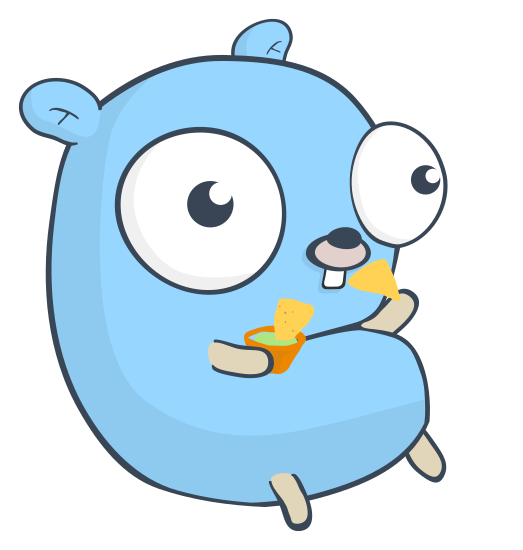

# go-nachos

[1] Special thanks to [@egonelbre](https://github.com/egonelbre) for the [gopher vector](https://github.com/egonelbre/gophers)  
[2] The Go gopher was designed by [Renee French](http://reneefrench.blogspot.com/).
The Gopher character design is licensed under the Creative Commons 3.0 Attributions license.  
[3] Vector of the Nachos used in picture above was <a href="https://www.freepik.com/free-vector/hand-drawn-mexican-food-collection_851169.htm">designed by Freepik</a>

---

This is a complete rewrite of Nachos (Not another completely heuristical operating system) hosted
at [nachos](https://homes.cs.washington.edu/~tom/nachos/).

Golang specific code:
* Thread forking - thread forking was initially carried out via assembly code which used to save
  context of current thread and switch to the other thread. I have modified it to use channels
  instead where a thread only runs when its channel is active. This would also enable implementing
  multi-threading if one really wants to try that on nachos.

This code is at a stage where none of the syscalls are implemented (which itself is a good exercise for
understanding the nachos code).
